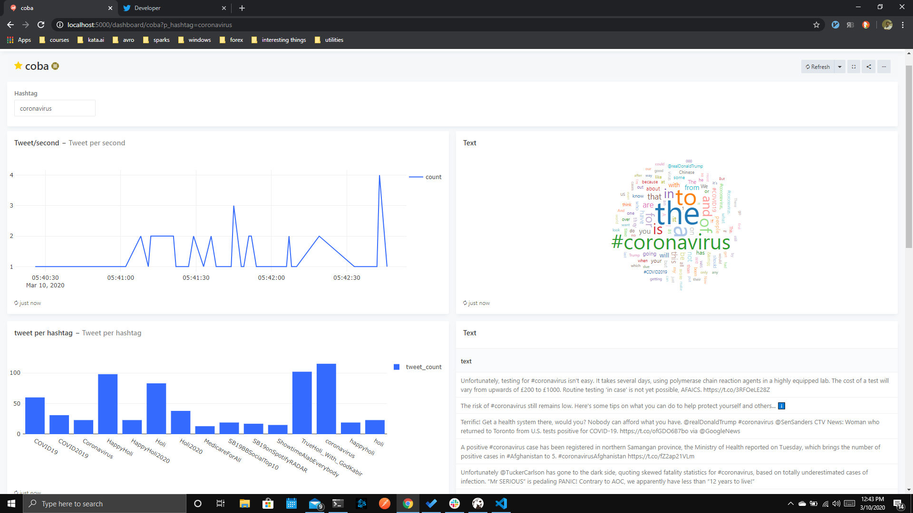

# Apa yang akan kita buat

Crawl data dari twitter, simpan ke postgresql, dan ingest pakai redash:



# Bagaimana semua ini akan bekerja


# Yang dibutuhkan

* docker
* docker-compose
* koneksi internet
* twitter developer account (https://developer.twitter.com/)

# Yang sebenarnya dibutuhkan (di balik layar)

* Python
* Tweepy (Untuk stream tweet dari twitter)
* Postgre SQL (Pakai DB apapun boleh)
* Redash (Untuk query dan visualisasi)

# Apa itu docker

> Docker is a set of platform as a service products that uses OS-level virtualization to deliver software in packages called containers. Containers are isolated from one another and bundle their own software, libraries and configuration files; they can communicate with each other through well-defined channels

Sederhananya: Docker seperti virtual machine dengan share kernel.

## Bagaimana menginstall docker

```
sudo apt-get install docker docker-compose
```

Atau download di [https://www.docker.com/](https://www.docker.com/)

# Apa itu tweepy

Library Python untuk mengakses twitter API [http://www.tweepy.org/](http://www.tweepy.org/)

# Apa itu redash

Data analytic framework [https://redash.io/](https://redash.io/)

# Persiapkan environment

```sh
cp environment.template.env environment.env
vim environment.env # atau buka text editor yang biasa kalian pakai
```

Edit `TWITTER_ACCESS_TOKEN`, `TWITTER_ACCESS_TOKEN_SECRET`, `TWITTER_CONSUMER_KEY`, dan `TWITTER_CONSUMER_SECRET`

dan simpan.

## Persiapkan semua docker container dan jalankan

```sh
docker-compose run --rm server create_db
docker-compose up
```

# Beberapa Query menarik

Jumlah tweet per detik (60 terakhir)

```sql
SELECT COUNT(tweet_id), created_at
FROM
    (
        SELECT DISTINCT tweet_id, created_at FROM tweet.statuses ORDER BY created_at DESC LIMIT 60
    ) As tabulated
GROUP BY created_at;
```

Jumlah tweet by hashtag

```sql
SELECT COUNT(tweet_id) as tweet_count, hashtag FROM 
    (SELECT DISTINCT tweet_id, "text", hashtag FROM postgres.tweet.statuses) AS tabulated
GROUP BY hashtag
ORDER BY tweet_count DESC LIMIT 15;
```

Text by hashtag

```sql
SELECT "text" FROM postgres.tweet.statuses WHERE hashtag='{{hashtag}}'
```